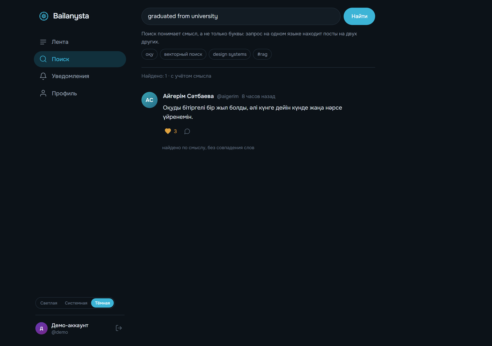
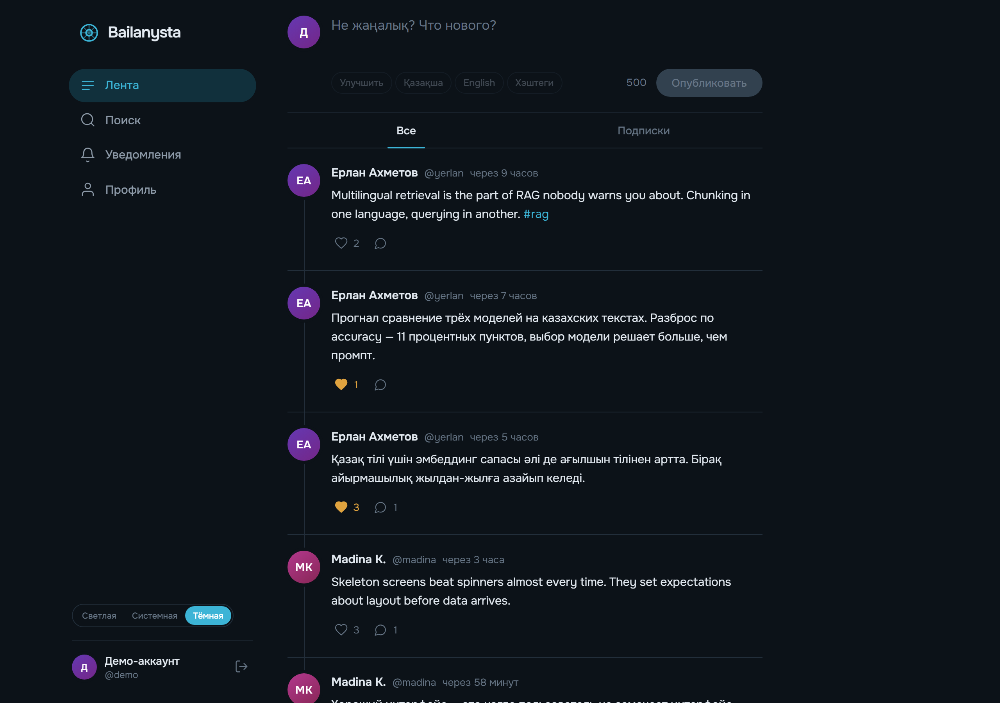
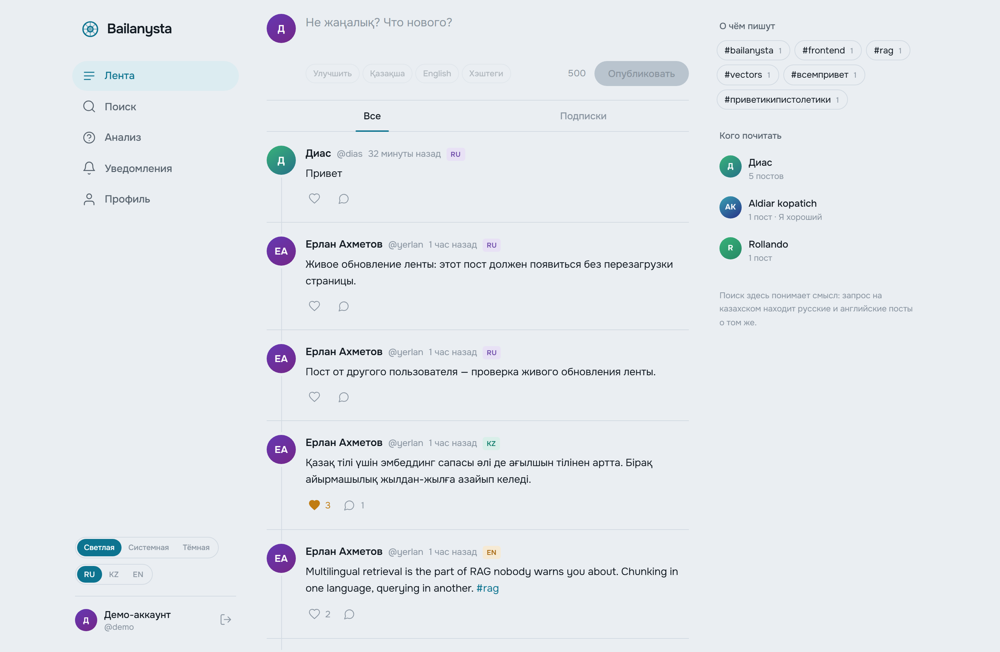
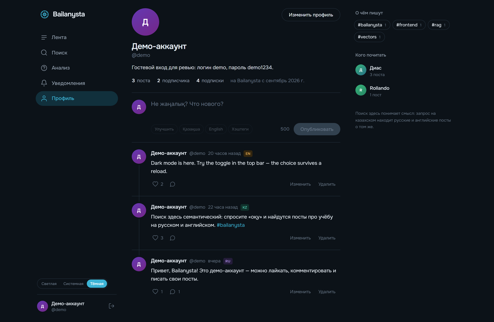
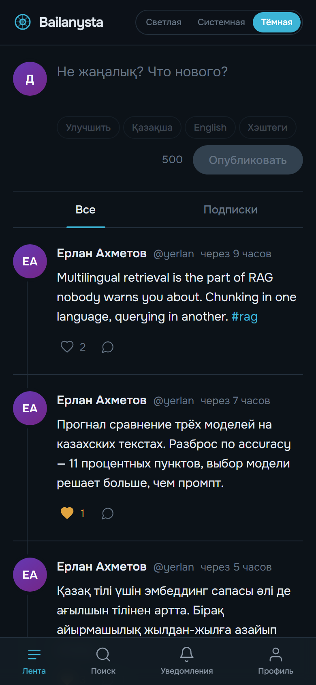
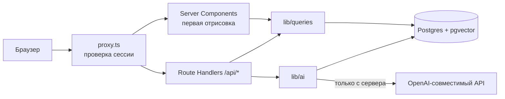

# Bailanysta

[](https://github.com/Diaaass/Bailanysta-/actions/workflows/ci.yml)

Социальная сеть, в которой поиск понимает смысл, а не только буквы. Запрос на казахском находит посты на русском и английском — и наоборот.

Название от казахского **байланыс** — связь. Это и тема продукта, и то, что лежит в основе его главной функции.

**Живая версия:** https://bailanystadtech.vercel.app
**Демо-доступ:** `demo` / `demo1234`

---

## Что умеет

**Базовое:** лента, создание/редактирование/удаление постов, профили, подписки, лайки, комментарии, уведомления.

**Что отличает от типовой ленты:**

- **Кросс-языковой семантический поиск.** Каждый пост при публикации превращается в вектор из 1536 чисел и ложится в pgvector. Поиск сравнивает смыслы, а не подстроки. Запрос `graduated from university` находит казахский пост «Оқуды бітіргелі бір жыл болды» — без единого общего слова.
- **Гибридное ранжирование.** Векторное совпадение объединяется с текстовым: точные вхождения и хэштеги не теряются, но и смысловые находки не остаются за бортом.
- **AI-композер.** Улучшить формулировку, перевести между RU/KZ/EN, подобрать хэштеги. Всё — серверными вызовами, ключ в браузер не попадает.
- **RAG по своим постам.** Отдельная страница «Анализ»: вопрос вроде «о чём я чаще писал за месяц» уходит в модель вместе с вашими же записями, а ответ размечен ссылками на конкретные посты. Выборка гибридная — свежие за период плюс близкие по смыслу, потому что точечные и агрегирующие вопросы требуют разного.
- **Честная деградация.** Без ключа AI приложение не падает: поиск откатывается на текстовый, интерфейс прямо сообщает об этом.

---

## Как выглядит

Английский запрос находит казахский пост — ни одного общего слова:



| Лента, тёмная тема | Лента, светлая тема |
|---|---|
|  |  |

| Профиль | Мобильная вёрстка |
|---|---|
|  |  |

Скриншоты пересобираются командой `npm run screenshots` — они не правятся руками и не устаревают незаметно.

---

## Стек и почему он

| Слой | Выбор | Почему |
|---|---|---|
| Фронтенд | Next.js 16, React 19, TypeScript, Tailwind v4 | Фронт и бэк в одном развёртывании — для проекта такого размера отдельный сервер только добавил бы работы |
| API | Route Handlers (`/api/*`) | Настоящий REST, который видно и можно позвать извне |
| БД | Postgres (Neon) + Drizzle + pgvector | Реляционные данные и векторы в одной базе: не нужен второй сервис, поиск делается одним SQL |
| Аутентификация | Auth.js v5, Credentials | Без внешнего провайдера — проверяющий заводит аккаунт за десять секунд |
| AI | Любой OpenAI-совместимый эндпоинт | Провайдер меняется переменной окружения, а не правкой кода |
| Хостинг | Vercel | Нулевая настройка для Next.js |

**Про pgvector вместо отдельной векторной БД.** Pinecone или Qdrant дали бы больше на масштабе, но потребовали бы синхронизировать два хранилища и держать их консистентными. При объёме в тысячи постов pgvector в той же транзакции, что и сами посты, — заметно меньше движущихся частей.

**Про свой REST вместо Server Actions.** Server Actions короче в коде, но backend становится невидимым: нельзя позвать `curl`, нельзя показать контракт. Для задачи, где бэкенд — часть результата, это существенно.

---

## Запуск

Нужны Node.js 20.9+ и база Postgres с расширением pgvector (подойдёт бесплатный тариф [Neon](https://neon.tech)).

```bash
git clone https://github.com/Diaaass/Bailanysta-.git
cd Bailanysta-
npm install
```

Включите pgvector в своей базе:

```sql
CREATE EXTENSION IF NOT EXISTS vector;
```

Создайте `.env.local` по образцу `.env.example`:

```bash
DATABASE_URL="postgresql://...@...-pooler.../neondb?sslmode=require"
AUTH_SECRET="случайная строка: node -e \"console.log(require('crypto').randomBytes(32).toString('base64'))\""

AI_BASE_URL="https://generativelanguage.googleapis.com/v1beta/openai"
AI_API_KEY="ключ Google AI Studio"
AI_MODEL="gemini-3.6-flash"
AI_EMBEDDING_MODEL="gemini-embedding-001"
```

`AI_*` можно оставить пустыми — приложение запустится, просто без семантики и композера.

Миграции, тестовые данные и запуск:

```bash
npm run db:migrate
npm run db:seed
npm run db:embed     # проиндексировать посты; нужен AI_API_KEY
npm run dev
```

| Команда | Что делает |
|---|---|
| `npm run db:generate` | сгенерировать миграцию из схемы |
| `npm run db:migrate` | применить миграции |
| `npm run db:seed` | 5 пользователей, 15 постов на трёх языках, лайки, комментарии, подписки |
| `npm run db:embed` | посчитать эмбеддинги для постов без вектора |
| `npm run db:check` | проверить подключение и наличие pgvector |
| `npm test` | юнит- и интеграционные тесты |
| `npm run test:e2e` | сквозные сценарии в браузере |
| `npm run screenshots` | пересобрать скриншоты для документации |

---

## Как устроено

```
src/
  app/
    (auth)/          вход и регистрация
    (main)/          лента, профиль, пост, поиск, уведомления
    api/             REST: посты, лайки, комментарии, подписки, поиск, AI
  components/
    ui/              Avatar, Button, Skeleton, EmptyState
    post/            PostCard, PostComposer, Feed, CommentThread, AiAssist
    layout/          Nav, ThemeToggle, Logo
  lib/
    db/              схема Drizzle и клиент
    queries/         доступ к данным: posts, users, search, notifications
    ai/              клиент модели, промпты, индексация, rate-limit
  proxy.ts           защита маршрутов
```

Дерево компонентов строится снизу вверх: примитивы → доменные компоненты → страницы. Данные всегда идут сверху вниз, состояние живёт в ближайшем общем родителе (`Feed` владеет списком постов, `PostCard` его только отображает и сообщает об изменениях наверх).



### Как работает поиск

1. При публикации поста текст уходит в модель эмбеддингов и возвращается вектором на 1536 чисел, который пишется в колонку `posts.embedding`.
2. Запрос пользователя превращается в вектор тем же способом.
3. Postgres считает косинусное расстояние по HNSW-индексу и отдаёт ближайшие посты.
4. Параллельно идёт обычный `ILIKE` по тексту.
5. Результаты объединяются: текстовое совпадение даёт 0.45 балла, семантическое — до 0.55 в зависимости от близости. Пост, попавший в оба списка, поднимается наверх.

Порог отсечения выведен из замеров, а не подобран на глаз (`scripts/probe-distance.ts`):

| Запрос | Расстояние до настоящих совпадений | До первого нерелевантного |
|---|---|---|
| `оқу` | 0.35, 0.36 | 0.43 |
| `векторный поиск` | 0.23, 0.33 | 0.43 |
| `design systems` | 0.37 | 0.45 |
| `рецепт борща` (такой темы нет) | — | 0.47 |

Отсюда порог **0.42**: он пропускает настоящие совпадения и на заведомо бессмысленном запросе честно отдаёт пустую выдачу вместо правдоподобного мусора.

**Измеренная стоимость:** эмбеддинг одного поста — в среднем 464 мс, p95 759 мс (15 постов, 0 ошибок).

---

## Тесты и CI

```bash
npm test
```

**63 теста**, разделённых на два вида.

**Юнит** — чистые функции без базы: схемы валидации, форматирование времени, генерация аватаров, склонение числительных.

**Интеграционные** — слой `lib/queries` против настоящего Postgres с pgvector. Данные не берутся из общего сида: каждый прогон строит собственный детерминированный набор, в котором два поста намеренно созданы в одну и ту же секунду.

Два теста написаны как регрессионные — на конкретные баги, найденные в этом проекте (описаны ниже). Проверено, что они действительно ловят: при возврате старого кода падают 4 и 2 теста соответственно.

**Сквозные** — тринадцать сценариев в настоящем браузере поверх production-сборки: регистрация, выход и повторный вход, публикация, редактирование, лайк с проверкой после перезагрузки, комментарий, подписка и переключение ленты, правка профиля, поиск, переключение темы, защита маршрутов. Каждый спек заводит собственных пользователей со случайными именами, поэтому прогоны не мешают друг другу.

Именно сквозной тест нашёл то, чего не видели остальные: при самостоятельном запуске сборки на нестандартном порту Auth.js отвергал все сессии с ошибкой `UntrustedHost`. На Vercel хост определяется автоматически, поэтому ни разработка, ни продакшен проблему не показывали.

CI на GitHub Actions поднимает контейнер `pgvector/pgvector:pg17`, применяет миграции и прогоняет типы, линт, тесты и сборку на каждый push — то есть интеграционные тесты работают с тем же расширением, что и продакшен, а не с заглушкой.

---

## Решения и компромиссы

**Аутентификация по логину и паролю, а не OAuth.** OAuth удобнее пользователю, но проверяющему пришлось бы заводить приложение в GitHub или Google. Цена — своя работа с паролями (bcrypt, 10 раундов) и отсутствие восстановления доступа.

**Эмбеддинг считается синхронно при публикации.** Создание поста из-за этого длится примерно на 460 мс дольше. Вынести в фон нельзя: serverless-функция замораживается сразу после ответа, фоновая задача просто не выполнится. Правильное решение — очередь, но она тянет за собой ещё один сервис.

**Курсорная пагинация вместо бесконечного скролла.** Курсор устойчив к появлению новых постов во время листания, в отличие от `OFFSET`, который начинает дублировать записи. Кнопка «Показать ещё» вместо автоподгрузки — сознательно: так работает клавиатура и предсказуемо ведёт себя история переходов.

**Уведомления на поллинге раз в 30 секунд.** WebSocket или SSE дали бы мгновенность, но потребовали бы держать соединение — на serverless это отдельная инфраструктура ради второстепенной функции.

**Нет загрузки изображений.** ТЗ этого не требует, а хранилище, ресайз и модерация — это отдельный проект. Аватары генерируются из имени пользователя детерминированно: одинаковый цвет и инициалы везде, без единого запроса в сеть.

**Одно семейство шрифтов.** Onest выбран не по вкусу, а по ограничению: нужен полный казахский кириллический набор (ә, ғ, қ, ң, ө, ұ, ү, і, һ), которого нет у большинства дисплейных шрифтов. Индивидуальность добрана типографической шкалой и вёрсткой, а не вторым шрифтом.

---

## Известные проблемы

- **Лимит запросов стоит двух обращений к базе.** Счётчик перенесён из памяти инстанса в таблицу `ai_usage`, поэтому потолок наконец честный — но каждая проверка идёт в Postgres. При заметной нагрузке правильнее Redis со счётчиком и TTL.
- **Сквозные тесты идут без ключа AI.** Композер и RAG в них проверяются только по деградированному пути: гонять живую модель в CI — значит платить за каждый прогон и зависеть от внешней доступности.
- **Поиск ограничен 25 результатами без пагинации.** На текущем объёме незаметно, на десятках тысяч постов понадобится листание.
- **HNSW-индекс построен с параметрами по умолчанию.** До нескольких десятков тысяч постов этого достаточно, дальше нужно подбирать `m` и `ef_construction`.
- **Посты, у которых эмбеддинг не посчитался**, находятся только текстовым поиском, пока не выполнить `npm run db:embed`. Это осознанно: сбой индексации не должен ронять публикацию.
- **Счётчик уведомлений обновляется при переходе между страницами и раз в 30 секунд**, поэтому может отставать на несколько секунд.

---

## Что оказалось неочевидным

Две вещи, которые стоили времени и которые не видно из документации.

**Drizzle квалифицирует имена колонок только при наличии JOIN.** Коррелированный подзапрос в профиле выглядел корректно:

```ts
sql`(select count(*) from ${posts} where ${posts.authorId} = ${users.id})`
```

но в запросе без JOIN превращался в `where "author_id" = "id"` — и `"id"` внутри подзапроса связывался с `posts.id`, а не с `users.id`. Условие всегда ложно, счётчик постов всегда ноль. Счётчик подписчиков при этом работал — но не потому, что код был верен, а потому что у таблицы `follows` нет колонки `id`, и имя подтягивалось из внешнего запроса. Такое не ловится ни типами, ни проверкой «страница открылась»: только сверкой с эталонным SQL. Подзапросы теперь квалифицированы явно.

**Модели с рассуждением списывают внутренние токены из `max_tokens`.** При лимите 400 переводы обрывались на середине слова, хотя `finish_reason` был `stop`. Лимит поднят до 1200.

---

## Решения, записанные отдельно

Выборы, которые трудно отменить или легко оспорить, не зная контекста, вынесены
в [docs/decisions](docs/decisions/) — семь коротких записей формата
«контекст, решение, последствия», включая плохие последствия и то, что заставило
бы решение пересмотреть.

---

## Процесс

Работа шла блоками с проверкой после каждого. Первым делом — не интерфейс, а каркас с рабочей сборкой: пустой экран, который уже собирается, лучше готовой фичи, которая не разворачивается.

Проверялось запуском, а не чтением кода: полный цикл аутентификации и CRUD прогонялись через `curl` по живому серверу, счётчики сверялись с эталонным SQL, вёрстка — скриншотами в обеих темах. Так нашлись оба бага выше и наложение линии ленты на аватар, незаметное в тёмной теме.

20 коммитов, около 6704 строк, 10 страниц, 13 API-эндпоинтов, 22 компонентов, 72 теста плюс 13 сквозных сценариев.
